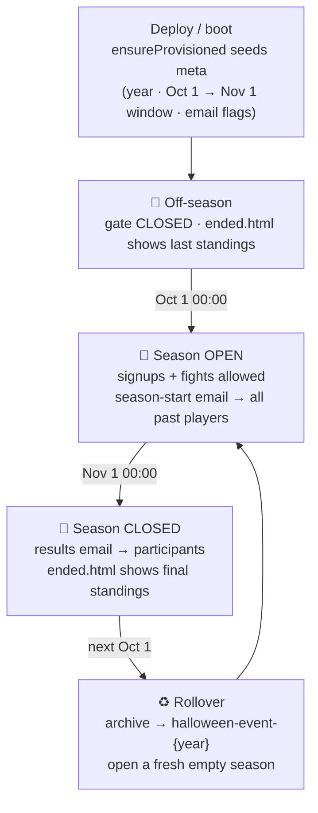
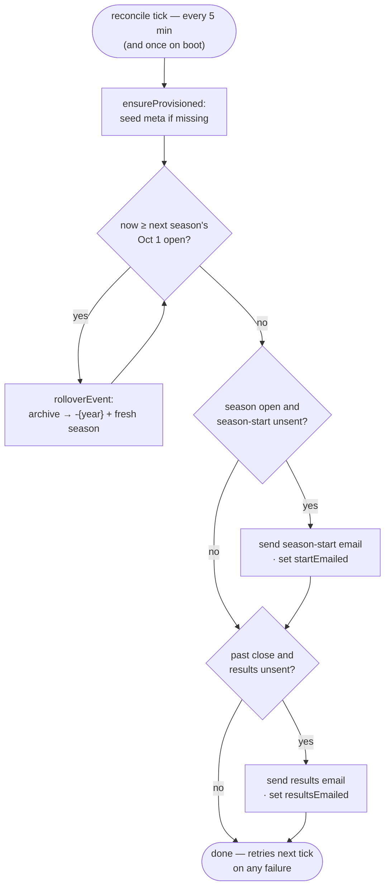
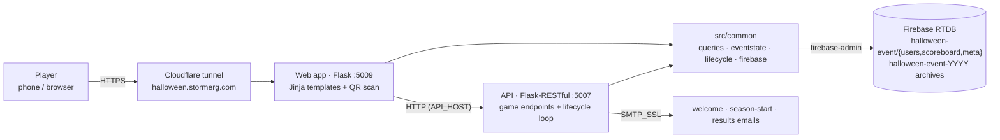

# The Long Night

A Halloween party game. Every participant gets a personal QR code; players scan each other's codes
to trigger a randomized **fight** — the winner gets +2 points, the loser +1, and any pair may fight
only once. State lives in a Firebase Realtime Database. It runs as two Docker containers on a
Raspberry Pi 4 (aarch64), Python 3.12.

## How it works

- **Sign up** on the web app to get a QR code emailed to you.
- **Scan** another player's QR code to fight them. The winner is random; scores update live.
- A **live scoreboard** shows every fight.
- When the season ends, everyone gets a **results email** summarizing their fights.
- **Optional yearly prize:** if a gift card is configured for the season, its label is advertised in
  the sign-up and season-start emails, and the redemption code is emailed to the single top-scoring
  winner when the season ends (see [Configuration](#configuration)).

## Seasonal, self-restarting lifecycle

The game runs **one season per year, every October**, and restarts itself with no manual work:

| When | What happens |
| --- | --- |
| **Oct 1 → Nov 1** | Season is **open** — sign-ups and fights allowed. |
| **Nov 1 00:00** (close) | Game closes; final **results email** sent. The site shows the finished standings all off-season. |
| **Oct 1 00:00** (next year) | The finished season is archived to `halloween-event-{year}`, a fresh empty season opens, and a **"new season" email** goes to everyone who has ever played. |

The active window is **Oct 1 → Nov 1** by rule (`SEASON_OPEN`/`SEASON_CLOSE` in
`src/common/eventstate.py`). The current season's window and identity live in the database at
`halloween-event/meta`:

```json
"meta": {
  "year": 2026,
  "openTime":  "10/01/26 12:00:00 AM",
  "closeTime": "11/01/26 12:00:00 AM",
  "resultsEmailed": false,
  "startEmailed": false
}
```

so the schedule auto-advances and stays correct across restarts. The API runs the lifecycle on a
5-minute reconcile loop that is idempotent and self-healing — see `src/common/lifecycle.py`.

**The annual cycle:**



**The reconcile heartbeat** (idempotent — re-derives everything from `meta` + `now` each tick):



## Architecture

Two independent Flask apps share `src/common/`:

- **API** (`src/api/api.py`, port **5007**, HTTP) — Flask-RESTful resources: `Scoreboard` (GET),
  `Fight` (POST), `Users` (POST register / PUT update), `Login` (POST); every request requires the
  `X-API-Key` header. Owns the season lifecycle.
- **Web app** (`src/app/app.py` + `src/app/views.py`, port **5009**, HTTPS self-signed) — renders
  Jinja templates and calls the API (sending the shared `X-API-Key`). Server-side in-memory sessions;
  Cloudflare Turnstile + CSRF tokens on its forms; QR scanning via `cv2`.

`src/common/`: `firebase.py` (DB facade), `queries.py` (game logic + email), `eventstate.py` (the
seasonal calendar / gating), `lifecycle.py` (archive + reset + promo engine, API-only).

Data layout in Firebase: live season under `halloween-event/{users,scoreboard,meta}`; past seasons
archived under `halloween-event-{year}`.



## Running locally

Requires `api.env`, `app.env`, and `serviceAccountKey.json` in the repo root (the `*.env.example`
files document the schema; real values come from deployment).

```bash
docker compose -f docker-compose-prod.yml up -d --build
docker compose -f docker-compose-prod.yml ps
docker compose -f docker-compose-prod.yml logs --tail=20 halloween-api-prod
```

## Tests

pytest isn't baked into the images; run it in an ephemeral container against the webapp image (the
only one with `libgl1` for `cv2`). The `IMAGE_TAG=test` prefix is **required on the Pi**: a build
under the default `:latest` name changes the local image ID, which the deploy-watcher reads as a newly
published image and answers with a hard `git reset --hard` redeploy (wiping uncommitted work). A
`:test`-tagged build is invisible to it:

```bash
IMAGE_TAG=test docker compose -f docker-compose-prod.yml build halloween-webapp-prod
IMAGE_TAG=test docker compose -f docker-compose-prod.yml run --rm --no-deps --entrypoint sh \
  halloween-webapp-prod -c "pip install -q -r requirements-dev.txt && python -m pytest -q"
```

## Manual E2E QA (no real data, no real emails)

QA reuses the **real** environment — same domain, same Firebase project, same SMTP — and isolates
itself purely by switching the **data node**. The domain serves prod *or* QA at a given time, so QA
temporarily runs in place of prod with the real `api.env` / `app.env` plus:

| key | value | why |
| --- | --- | --- |
| `EVENT_ROOT` (both apps) | `qa-halloween-event` | **required** — all reads/writes/archives use `qa-*` nodes; real `halloween-event*` data is untouched |
| `EMAIL_OVERRIDE_RECIPIENT` (api) | your address | *optional* — routes the season-start blast to you (so you can see it), and guards against ever mailing a real address |
| `GIFT_CARD_LABEL`/`GIFT_CARD_CODE`/`GIFT_CARD_YEAR` (api) | fake label + code + the season's year | *optional* — to QA the prize; set all three (`YEAR` = the sandbox season's year) to test it ON, leave unset to test it OFF. Use a fake code, never a real card |

Everything else (real `WEBAPP_HOST` domain, `API_HOST`, Firebase creds, SMTP) stays real — so the
QR/email links are the real domain and work on your phone. Drive the season with the harness (it
runs inside a container and refuses to run unless `EVENT_ROOT` is off the prod node):

The `IMAGE_TAG=qa` prefix makes these local builds invisible to the deploy-watcher (same reason as
the `:test` tag under [Tests](#tests)). The build reads your working tree, so committing your branch
first isn't required — it's an optional safety net against an unrelated watcher trigger mid-session.

```bash
IMAGE_TAG=qa docker compose -f docker-compose-prod.yml up --build -d
run() { IMAGE_TAG=qa docker compose -f docker-compose-prod.yml run --rm --no-deps --entrypoint sh \
          halloween-api-prod -c "python scripts/qa_lifecycle.py $*"; }
run "open --minutes 30"      # open a sandbox season now (also seeds past players; prints prize state)
run "tick"                   # fire the season-start email
run "close" && run "tick"    # force-close + fire the results email immediately
run "restart --minutes 30"   # archive + open a fresh season
run "status"                 # inspect sandbox state
run "wipe"                   # delete sandbox nodes when done
```

Then on the real domain (now serving the QA stack): sign up, fight, watch the scoreboard. `tick`
just runs the reconcile loop once so scheduled emails fire immediately (the app does this every
5 min on its own); gating reflects the window instantly.

Notes:
- **One-time setup:** the sandbox node needs the same `.indexOn: ["email"]` rule on
  `qa-halloween-event/users` that prod has on `halloween-event/users` (add it once in the Firebase
  console). Without it the email-lookup query behind signup/login returns HTTP 400.
- QA and prod can't run at the same time (shared domain/host); QA replaces prod for the session.
- A fight needs two accounts and one to scan the other's QR (or visit
  `…/fight/?scannedUserKey=<otherKey>` while logged in as the first).
- For a quick laptop-only smoke (no phone links), additionally override
  `WEBAPP_HOST=https://localhost:5009` and `API_HOST=http://halloween-api-prod:5004`.

## Configuration

Env vars are loaded in `src/{api,app}/properties.py`.

- **`api.env`** (required): `VERSION`, `WEBAPP_HOST`, `API_KEY`, `FIREBASE_CONFIG_JSON`, `EMAIL_HOST`,
  `EMAIL_PORT`, `EMAIL_SENDER`, `EMAIL_PASSWORD`. Optional: `API_PORT`, `LOG_LEVEL`, `TZ`,
  `GIFT_CARD_LABEL`, `GIFT_CARD_CODE`, `GIFT_CARD_YEAR` (the yearly prize — see below).
- **`app.env`** (required): `VERSION`, `API_HOST`, `API_KEY`, `FIREBASE_CONFIG_JSON`. Optional:
  `WEBAPP_PORT`, `SECRET_KEY`, `LOG_LEVEL`, `TZ`, `TURNSTILE_SITE_KEY`, `TURNSTILE_SECRET_KEY`.
- `API_KEY` is the shared web↔API secret and **must match in both files**. `SECRET_KEY` falls back to
  a random per-boot key if unset (set it for stable sessions). Cloudflare **Turnstile** on
  signup/login is disabled when `TURNSTILE_SECRET_KEY` is blank.
- **QA-only** (leave unset in production): `EVENT_ROOT` (both apps; sandbox DB node) and
  `EMAIL_OVERRIDE_RECIPIENT` (api; redirect all outgoing mail).

There is no cutoff env var — the season window is hardcoded in `eventstate.py`.

### The yearly gift-card prize

An optional prize for the season's top scorer, driven by three `api.env` vars:

| var | example | meaning |
| --- | --- | --- |
| `GIFT_CARD_LABEL` | `$50 Amazon gift card` | what players are playing for (shown in emails) |
| `GIFT_CARD_CODE` | `XXXX-YYYY-ZZZZ` or a redemption URL | the secret code, emailed to the winner only (an `http(s)` URL renders as a clickable link, a plain code as a letter-spaced box) |
| `GIFT_CARD_YEAR` | `2026` | the season year this card is for |

The prize is active **only when all three are set and `GIFT_CARD_YEAR` matches the season's year** —
otherwise it's completely dormant (nothing announced, nothing sent). That exact-year gate means a
**stale entry can never leak into a later season**: if you forget to update it, next October the
prize is simply silent rather than re-sending last year's code. When active, the label is advertised
in the sign-up and season-start emails, and at close the code goes to **exactly one** winner —
`pickGiftCardWinner` (`src/common/queries.py`) breaks a top-score tie deterministically (most fight
wins → earliest to reach the final score → earliest sign-up).

**Updating it each year** (do this before Oct 1 so the season-start blast advertises it):

1. On the Pi, edit `~/Code/HalloweenEvent/api.env` (gitignored, survives deploys — never committed).
2. Set `GIFT_CARD_LABEL`, `GIFT_CARD_CODE`, and `GIFT_CARD_YEAR` to **this October's** year.
3. Redeploy to pick up the new env: `sh scripts/deploy.sh`.

No code change, no git, no CI — just the env file on the Pi. To **disable** the prize for a season,
leave any of the three blank.

## Deployment

CI/CD is **self-contained** (no external deploy service). On push to `master`, GitHub Actions
(`.github/workflows/ci.yml`) builds native **arm64** images and pushes them to **GHCR**
(`ghcr.io/cgoulart35/halloweenevent-{api,webapp}`). On the Pi, `scripts/deploy-watcher.sh` (started at
boot from `/etc/rc.local`) polls GHCR and, when a new image is published, runs `scripts/deploy.sh` —
`git reset --hard origin/master` then `docker compose -f docker-compose-prod.yml pull && up -d`. The
trigger is the **published image, not the commit**, so a deploy never races the build. Doc/CI-config-only
pushes (`**.md` / `.claude/` / `.github/`) are skipped by a `changes` gate, so they don't build or deploy.

`api.env` / `app.env` / `serviceAccountKey.json` are gitignored and live **persistently in the repo
dir on the Pi** — injected at runtime (`env_file:` + a volume mount), never baked into the image, and
untouched by `git reset --hard`. Only the `*.env.example` templates are tracked. Roll back with
`IMAGE_TAG=<short-sha> docker compose -f docker-compose-prod.yml up -d`.
